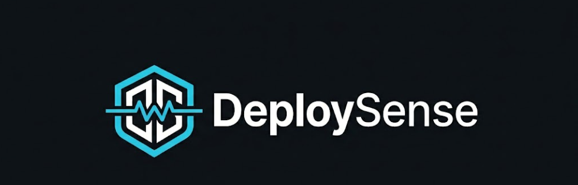

<div align="center">



# DeploySense

**Fix deployments before they break production.**

Open-source DevOps intelligence for Docker, Kubernetes, GitHub Actions, Docker Compose, and deployment logs.

</div>

<div align="center">

[](https://github.com/Abhi190702/DeploySense/actions/workflows/ci.yml)
[](https://www.npmjs.com/package/deploysense)
[](LICENSE)
[](https://github.com/Abhi190702/DeploySense/releases)
[](https://deploy-sense-web.vercel.app/)
[](https://deploysense-api.onrender.com/api/health)

[](https://scorecard.dev/viewer/?uri=github.com/Abhi190702/DeploySense)
[](https://www.bestpractices.dev/projects/12981)
[](https://codecov.io/gh/Abhi190702/DeploySense)
[](https://codecov.io/gh/Abhi190702/DeploySense)
[](https://github.com/codespaces/new?hide_repo_select=true&ref=main&repo=1248935551)

</div>

---

## Project Status

DeploySense is in active development (v0.1.1 public beta).

| Component | Status |
|---|---|
| Scanners (54+ rules) | ✅ Production ready |
| CLI | ✅ Production ready |
| Web Dashboard | ✅ Production ready |
| API | ✅ Hosted (cold start on free tier) / Self-hostable |
| GitHub Action | 🔧 Functional, marketplace release pending |
| VS Code Extension | 🔧 MVP built locally, marketplace release pending |

---

## What is DeploySense?

**DeploySense** catches deployment mistakes before they wake you up at 3 AM. It scans Dockerfiles, GitHub Actions workflows, Kubernetes manifests, Docker Compose files, and deployment logs — returning health scores, risk categories, plain-English explanations, and copy-paste fixes.

It is designed for three audiences:

- **Developers** who want a fast `npx deploysense scan .` before pushing.
- **Platform teams** who want CI guardrails that explain *why* something is risky.
- **Open-source contributors** who want a rule-based engine that is easy to extend.

> **Live product:** [deploy-sense-web.vercel.app](https://deploy-sense-web.vercel.app/) · API: [deploysense-api.onrender.com/api/health](https://deploysense-api.onrender.com/api/health)

---

## Quick Start

Run a scan without installing anything:

```bash
npx deploysense scan Dockerfile
```

Scan a whole project (detects all supported file types):

```bash
npx deploysense scan .
```

Use in CI to fail on high-severity issues and emit SARIF:

```bash
npx deploysense scan . --fail-on high --sarif
```

Diagnose a deployment log:

```bash
npx deploysense doctor deploy.log
```

---

## What It Detects

| Scanner | Rules | What it catches |
|---|:---:|---|
| **Dockerfile** | 20 | `latest` tags, root user, missing `HEALTHCHECK`, secret files, unsafe `curl \| sh`, bad cache order, missing `.dockerignore`, here-doc aware parsing |
| **GitHub Actions** | 12 | Missing `actions/checkout`, unpinned actions, broad permissions, no cache step, missing timeouts, no concurrency control |
| **Kubernetes** | 12 | Missing resource limits/requests, missing liveness/readiness probes, privileged containers, single replica, no `securityContext` |
| **Docker Compose** | 10 | Exposed database ports, hardcoded secrets, duplicate host ports, missing restart policies |
| **Log Doctor** | 30+ | `ImagePullBackOff`, `CrashLoopBackOff`, OOM kills, `ECONNREFUSED`, correlated failure chains |

---

## Features

| Capability | Status |
|---|---|
| Health score, grade, and status | ✅ Ready |
| Severity and category scoring | ✅ Ready |
| CLI scanner and project scan | ✅ Ready |
| Cross-file architecture graph | ✅ Ready |
| Express API server | ✅ Ready |
| Next.js web dashboard | ✅ Ready |
| SARIF output for code scanning | ✅ Ready |
| Markdown and JSON reports | ✅ Ready |
| Log Doctor with failure chains | ✅ Ready |
| Conservative auto-fix engine | ✅ Ready |
| GitHub Action | ✅ Functional (local use) |
| VS Code extension MVP | ✅ Built (local use) |
| Shareable report links | ✅ Ready |

---

## Enterprise Hardening

The scanner engine is hardened beyond simple regex matching:

- **Tokenized shell analysis** — Docker `RUN` rules use a shell tokenizer, not string matching. Commands like `apt-get`, `curl`, and `pip` are identified by token position, so line continuations and quoting do not cause false positives.
- **Here-doc aware parsing** — `RUN <<EOF` blocks are captured as a single logical instruction, preventing instruction-level rules from misinterpreting heredoc bodies.
- **Conservative auto-fix** — The fix engine refuses to mutate files containing Dockerfile here-docs or YAML anchors/aliases. It explains why and shows the fix as a suggestion instead.
- **Correlated failure chains** — Log Doctor groups related log events (e.g. `ImagePullBackOff` + rate-limit error) into a single high-confidence failure chain with an ordered remediation path.
- **Confidence metadata** — Every issue can include a confidence score, false-positive risk, and fix feasibility so teams can prioritize findings.

---

## CLI Reference

Install globally:

```bash
npm install -g deploysense
```

Commands:

```bash
deploysense scan Dockerfile           # Scan a single file
deploysense scan .                    # Scan a whole project
deploysense scan . --json             # JSON output
deploysense scan . --markdown         # Markdown report
deploysense scan . --sarif            # SARIF for GitHub code scanning
deploysense scan . --fail-on high     # Exit 1 if high+ issues found
deploysense doctor deploy.log         # Diagnose a deployment log
deploysense list-rules                # List all rules
deploysense fix Dockerfile --yes      # Apply safe auto-fixes
```

Example output:

```
Score: 68/100  [C]  Needs Improvement

Issues Found: 4
Critical: 0   High: 1   Medium: 2   Low: 1

[HIGH] DOCKER_NO_HEALTHCHECK
  Missing HEALTHCHECK instruction
  Fix: Add HEALTHCHECK CMD curl --fail http://localhost:3000/health || exit 1
```

---

## Web Dashboard

Live at [deploy-sense-web.vercel.app](https://deploy-sense-web.vercel.app/).

Run locally:

```bash
pnpm --filter web dev
```

The dashboard includes a Monaco code editor, project architecture graph, rules explorer, Log Doctor, docs, contribution guide, badge generator, and shareable report links.

---

## API

Live at [deploysense-api.onrender.com](https://deploysense-api.onrender.com/api/health).

> **Note:** The hosted API runs on Render's free tier and may have a cold start delay of 20–30 seconds after a period of inactivity. For instant results, run the API locally with `pnpm --filter api dev`.

Run locally:

```bash
pnpm --filter api dev
```

Scan a Dockerfile:

```bash
curl -X POST http://localhost:3001/api/scan/dockerfile \
  -H "Content-Type: application/json" \
  -d '{"content":"FROM node:latest\nCOPY . .\n"}'
```

---

## GitHub Action

```yaml
name: DeploySense

on:
  pull_request:
  push:
    branches: [main]

jobs:
  scan:
    runs-on: ubuntu-latest
    steps:
      - uses: actions/checkout@v4
      - uses: ./packages/github-action
        with:
          scan-path: .
          fail-on: high
          comment-pr: true
```

The action posts a score summary to pull request comments and fails the build on any issue at or above the configured threshold.

> The GitHub Action is functional for local workflow use. Marketplace release is on the roadmap.

---

## VS Code Extension

The VS Code extension MVP is built and functional locally. Marketplace publishing is on the roadmap.

To run it locally, open the `vscode-extension` folder in VS Code and press `F5` to launch the Extension Development Host.

---

## Profile Badge

Track your deployment health contributions with the DeploySense contribution badge:

```markdown

```

Example:


The badge shows your last 90 days of GitHub contribution activity as an isometric city — each day rendered as a stack of cubes proportional to your commit count.

> **Setup:** The badge requires `GITHUB_TOKEN` to be set in the API environment. Self-hosted deployments can set this in their environment variables.

---

## Architecture

```
                  DeploySense

   CLI          Web          API          GitHub Action
    |            |            |                 |
    +------------+------------+-----------------+
                 |
          scanner-core engine
                 |
   +-------------+-------------+--------------+-------------+
   |             |             |              |             |
Dockerfile  GitHub Actions  Kubernetes  Docker Compose  Log Doctor
```

Project scans also build an architecture graph connecting CI pipelines, Dockerfiles, image references, Kubernetes workloads, services, and exposed endpoints:

```
GitHub Actions → Dockerfile → Image → Kubernetes Deployment → Service
                         \→ Docker Compose service dependencies
```

This powers cross-file insights such as mutable image chains, missing pipelines, weak build/runtime linkage, and secret exposure paths.

---

## Security & OpenSSF

| Signal | Status |
|---|---|
| OpenSSF Scorecard | Active — monitors branch protection, pinned dependencies, token permissions |
| OpenSSF Best Practices | Passing badge earned |
| CodeQL | Active — static analysis on every push and PR |
| Dependabot | Configured for npm, Actions, and Docker |
| Codecov | Coverage tracked — CI uploads `coverage/lcov.info` |
| SECURITY.md | [Security policy and disclosure process](SECURITY.md) |

---

## Contributing

DeploySense is built for contributors. Every scanner rule is a small self-contained TypeScript file — you can add a new check in under 30 minutes.

Good first contributions:

- Add a new scanner rule
- Improve a rule explanation or example
- Add a Log Doctor pattern
- Improve the dashboard UX
- Expand docs and examples

See [CONTRIBUTING.md](CONTRIBUTING.md) for setup, rule-writing guidance, code style, and pull request workflow.

---

## Self-Hosting

```bash
docker compose up -d
# Opens at http://localhost
```

Runs the web dashboard, API server, and nginx reverse proxy.

---

## Roadmap

- [x] Core scanner engine and 54+ rules
- [x] CLI, API, web dashboard, GitHub Action, VS Code extension
- [x] npm package published
- [x] Public web and API deployment
- [x] OpenSSF Scorecard, CodeQL, Dependabot
- [x] OpenSSF Best Practices passing badge
- [x] Tokenized shell analysis and here-doc parsing
- [x] Conservative auto-fix with safety gates
- [x] Log Doctor failure chain correlations
- [x] Cross-file architecture graph
- [x] Contribution badge API (`/api/badge/contributions`)
- [ ] GitHub Action marketplace release
- [ ] VS Code marketplace release
- [ ] Persistent share storage
- [ ] OpenSSF Silver badge

---

## Maintainer

<table>
  <tr>
    <td align="center">
      <a href="https://github.com/Abhi190702">
        <br/>
        <strong>Abhi190702</strong>
      </a>
      <br/>
      <a href="https://github.com/Abhi190702/DeploySense">
        
      </a>
    </td>
  </tr>
</table>

---

## License

MIT. See [LICENSE](LICENSE).
